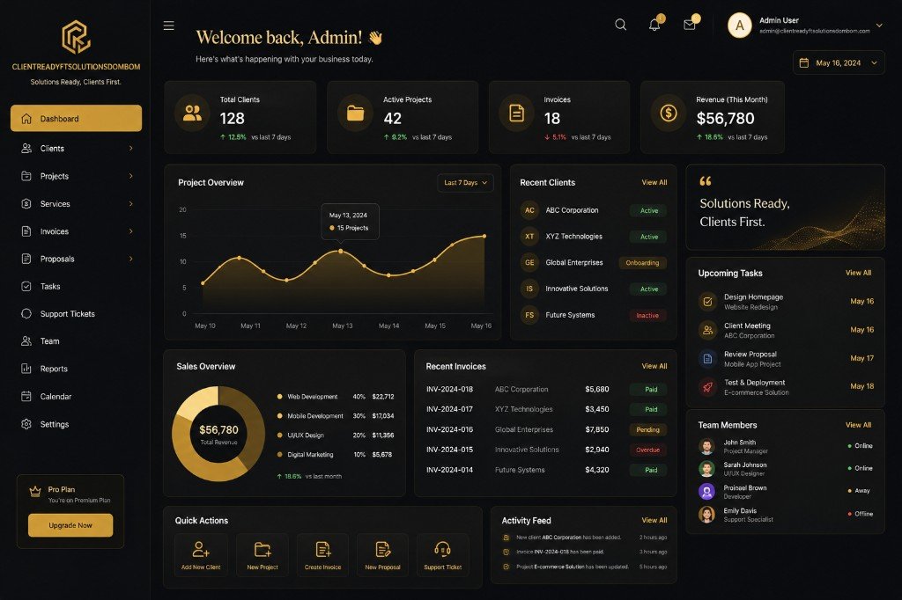

<div align="center">

# 🚀 Clientreadyftsolutionsdombom

**Clientreadyftsolutionsdombom — professional open source project.**

Documented · MIT licensed · Maintained

[](https://www.python.org/)
[](LICENSE)
[](CONTRIBUTING.md)

</div>

---

## Screenshots




## 🐍 Contribution graph

<picture>
  <source media="(prefers-color-scheme: dark)" srcset="https://raw.githubusercontent.com/mafzalkalwardev/clientreadyftsolutionsdombom/output/snake-dark.svg" />
  <source media="(prefers-color-scheme: light)" srcset="https://raw.githubusercontent.com/mafzalkalwardev/clientreadyftsolutionsdombom/output/snake.svg" />
  
</picture>

---

Client-ready Windows auto dialer for legitimate FT Solutions calling work.

## What It Does

- Automates Google Voice through embedded browser DOM/BOM JavaScript.
- Supports visible Google login/setup when Google requires password, 2FA, or CAPTCHA.
- Supports CSV and Excel contact lists.
- Provides old-style controls: **Start Dialing**, **X / Next Dial**, **Stop**.
- Writes call history to `logs\call_logs.csv` and the local CRM database.
- Supports client login through exported agent-only packages.

## Build

```bash
python build_exe.py
```

Output:

```text
release\FTSolutions_AutoDialer.exe
```

## Admin Setup

1. Run `release\FTSolutions_AutoDialer.exe`.
2. Create the first administrator account.
3. Open **Settings > Add account**.
4. Add the Google Voice line.
5. Choose **Connect now in visible browser** and finish Google login/2FA.
6. Confirm the line shows **Ready** in **Live Calls**.
7. Load a CSV/Excel contact list.
8. Press **Start Dialing**.

## Client Delivery

Use **Administration > Export client package** to create the client login package.

Give the client:

- `release\FTSolutions_AutoDialer.exe`
- Exported `dialer_config.json`
- Exported `logs\`
- Exported `data\`
- Exported `chrome_profiles\`

The client puts those files in one folder, runs the EXE, and signs in with the agent credentials you created.

## Contact List Format

CSV or Excel must include a phone column named one of:

```text
Phone, Mobile, Number, Tel, Telephone, Cell, Phone Number
```

Optional name column:

```text
Name, Full Name, Contact Name
```
